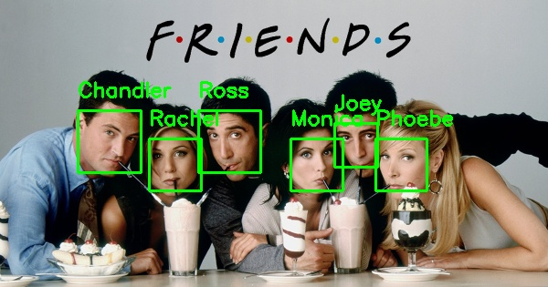
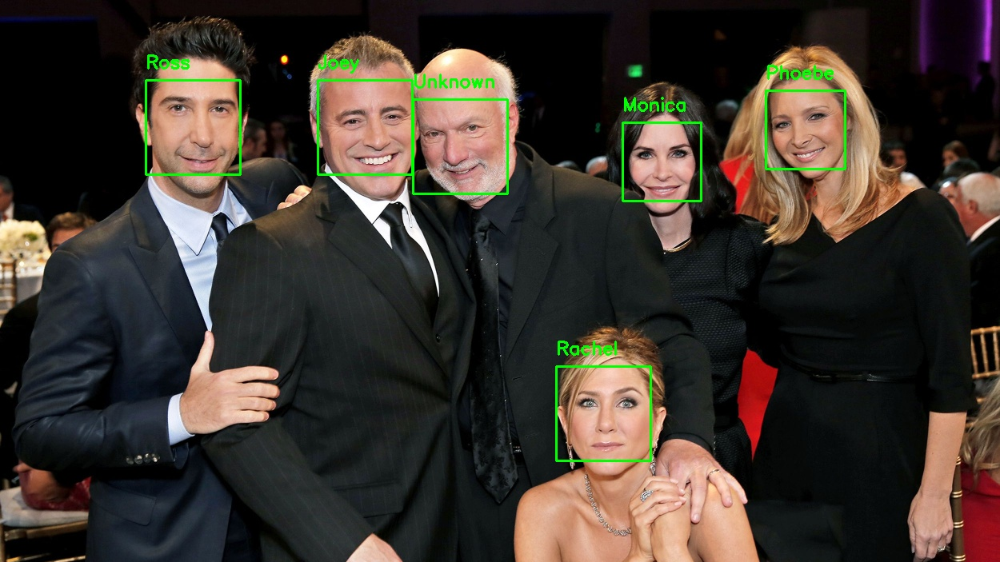
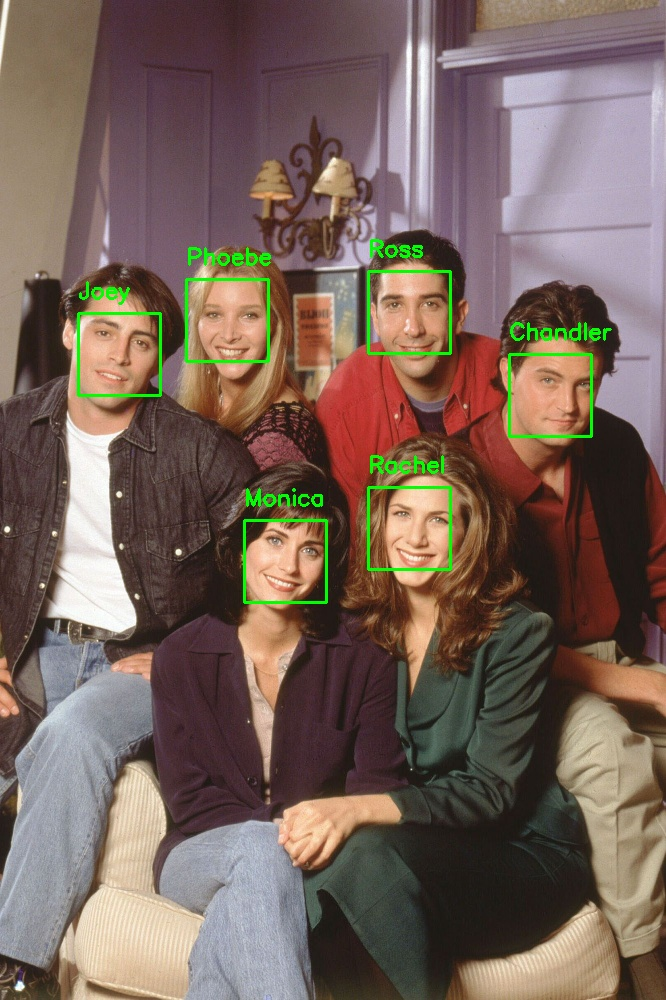

# FRIENDS-Characters-Face-Recognition

**To Train the Model with the Available Pictures**

> python encode_faces.py --dataset dataset --encodings encodings.pickle

**To Test the Model with Example Pictures and Save the Resulted Image**

> python recognize_faces_image.py --encodings encodings.pickle --image examples/ex-1.jpg --output output_result_image/ex-1-output.jpg

**To Test the model with Test Videos and Save the Resulted Video**

> python recognize_faces_video.py --encodings encodings.pickle --video videos/test3.mp4 --output output_result_videos/test3.avi --display 1

## Notes:
- '--display 0' ==> The prediction on video is displayed
- '--display 1' ==> The prediction on video is not displayed
- The deafult is '--display 1'.

# Predicted Images

# Predicted Videos

.gif')
